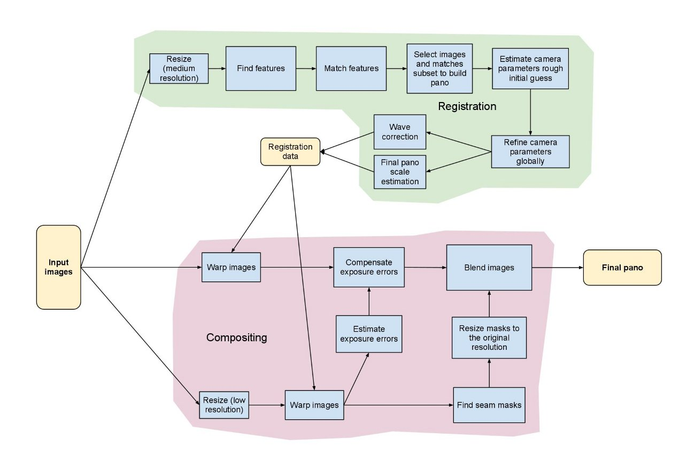

主要是基于opencv, 学习下图像融合,并延伸到视频融合.

<!-- more -->

# Sync opencv repo

当前opencv最新版本为[4.6.0](https://github.com/opencv/opencv/releases/tag/4.6.0)

```shell
$ git clone https://github.com/opencv/opencv.git -b 4.6.0
```

## 

# Build Opencv with Windows

使用wsl是不错的选择.

# Build Opencv with Android

## compile with ndk

## VS Code + NDK

修改cmake tools kit json, 添加android clang编译器

```
[
  {
    "name": "Android-Clang",
    "environmentVariables": {
      "ANDROID_NDK": "path/to/Android/Sdk/ndk/"
    },
    "compilers": {
      "C": "path/to/Android/Sdk/ndk/toolchains/llvm/prebuilt/windows-x86_64/bin/clang.exe",
      "CXX": "path/to/Android/Sdk/ndk/toolchains/llvm/prebuilt/windows-x86_64/bin/clang++.exe"
    }
  },
  ,
  {
    "name": "Visual Studio Community 2022 Release - amd64",
    "visualStudio": "9b8c874c",
    "visualStudioArchitecture": "x64",
    "preferredGenerator": {
      "name": "Visual Studio 17 2022",
      "platform": "x64",
      "toolset": "host=x64"
    }
  }
]
```

添加workspace的settings json

//.vscode/settings.json

```
{
    "cmake.configureArgs": [
        "-DCMAKE_TOOLCHAIN_FILE=${env:ANDROID_NDK}/build/cmake/android.toolchain.cmake",
        "-DANDROID_SDK=${env:ANDROID_NDK}/../..",
        "-DCMAKE_ANDROID_ARCH_ABI=arm64-v8a",
        "-DANDROID_ABI=arm64-v8a",
        "-DCMAKE_SYSTEM_VERSION=28",
        "-DANDROID_PLATFORM=android-28",
        "-DCMAKE_BUILD_TYPE=Release",
        "-DBUILD_DOCS=OFF",
        "-DBUILD_PERF_TESTS=OFF",
        "-DBUILD_TESTS=OFF",
        "-DBUILD_opencv_python=OFF",
        "-DBUILD_opencv_js=OFF",
        "-DBUILD_ANDROID_PROJECTS=OFF",
        "-DBUILD_ANDROID_EXAMPLES=OFF",
        "-DBUILD_JAVA=OFF"
    ]
}
```

for mingw
```
{
    "cmake.configureArgs": [
        "-DBUILD_PERF_TESTS=OFF",
        "-DBUILD_TESTS=OFF",
        "-DBUILD_opencv_python=OFF",
        "-DBUILD_opencv_js=OFF",
        "-DBUILD_ANDROID_PROJECTS=OFF",
        "-DBUILD_ANDROID_EXAMPLES=OFF",
        "-DBUILD_JAVA=OFF",
        "-DBUILD_ZLIB=OFF",
        "-DBUILD_EXAMPLES=ON"
    ],
    "cmake.generator": "MinGW Makefiles",
    "files.associations": {
        "iosfwd": "cpp"
    }
}
```

启动cmake configure\build

## NDK only

使用r21e版本为例,其它参考.

```shell
$ export ANDROID_NDK=/path/to/ndk
$ export ANDROID_SDK_ROOT=/path/to/android-sdk
$ export ANDROID_NATIVE_API_LEVEL=28
$ export STRIP=/path/to/ndk/toolchains/llvm/prebuilt/linux-x86_64/bin/llvm-strip
```
创建build目录, 并在build 目录执行
```shell
$ cmake -DCMAKE_TOOLCHAIN_FILE=/path/to/ndk/build/cmake/android.toolchain.cmake -DANDROID_TOOLCHAIN=clang++ -DANDROID_ABI=arm64-v8a -D CMAKE_BUILD_TYPE=Release -D ANDROID_NATIVE_API_LEVEL=28 -D WITH_CUDA=OFF -D WITH_MATLAB=OFF -D BUILD_ANDROID_EXAMPLES=OFF -D BUILD_DOCS=OFF -D BUILD_PERF_TESTS=OFF -D BUILD_TESTS=OFF -D ANDROID_STL=c++_shared -D BUILD_SHARED_LIBS=ON -D BUILD_opencv_objdetect=OFF -D BUILD_opencv_video=OFF -D BUILD_opencv_videoio=OFF -D BUILD_opencv_features2d=OFF -D BUILD_opencv_flann=OFF -D BUILD_opencv_highgui=ON -D BUILD_opencv_ml=ON -D BUILD_opencv_photo=OFF -D BUILD_opencv_python=OFF -D BUILD_opencv_shape=OFF -D BUILD_opencv_stitching=OFF -D BUILD_opencv_superres=OFF -D BUILD_opencv_ts=OFF -D BUILD_opencv_videostab=OFF -DBUILD_ANDROID_PROJECTS=OFF ..
```

> -G ninja

进行编译

```shell
$ make -j [nproc]
```

或者是使用ninja

```shell
$ninja -j [nproc]
```

# Opencv image stitch



> https://docs.opencv.org/4.x/d1/d46/group__stitching.html
