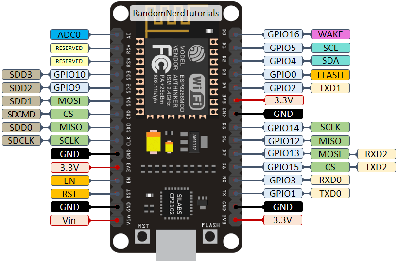
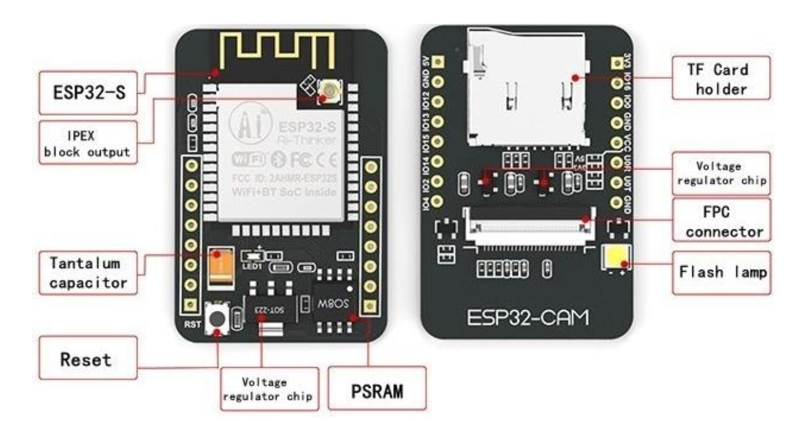
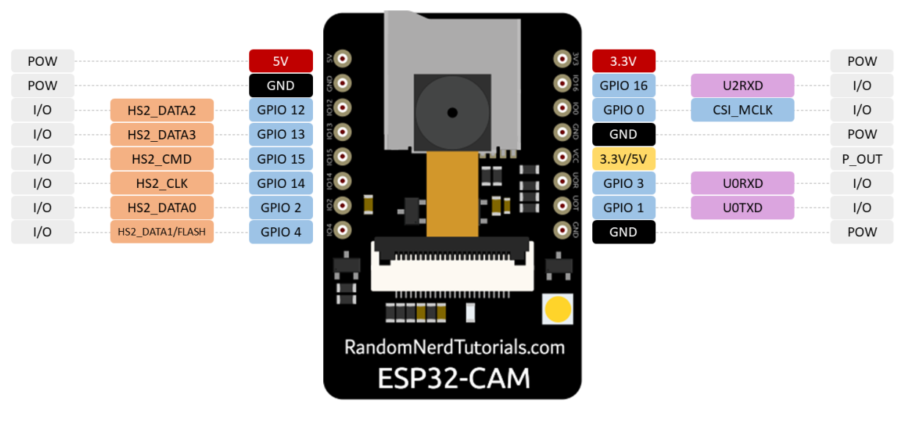
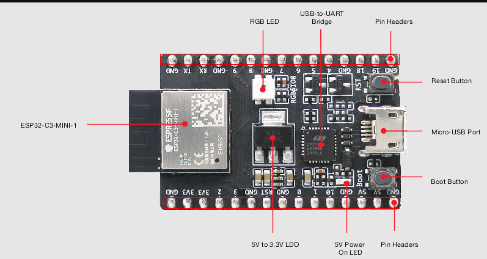
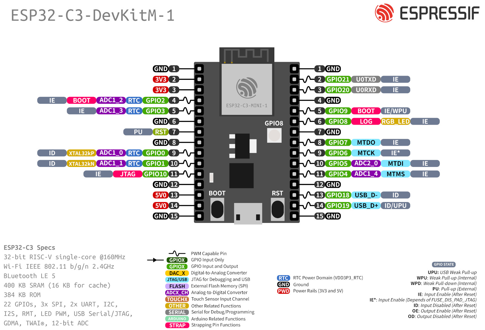

手里正好有两块开发板， ESP32 cam和ESP8266， 记录下
<!-- more -->

https://products.espressif.com/#/product-comparison


# Esp8266


**带有CP2102的ESP模块直接插上USB线即可烧入程序；而带有CH340的ESP模块直接连接电脑为运行内部程序的模式，如果要进入下载程序的模式，需要上电后按住FLASH按键，然后按一下RST键，即可发现电脑识别出了端口。**

http://arduino.esp8266.com/stable/package_esp8266com_index.json

[CP210x 驱动下载地址](https://www.silabs.com/documents/public/software/CP210x_Universal_Windows_Driver.zip)

## Datasheet

| Module Model           | ESP-12F                                                      |
| ---------------------- | ------------------------------------------------------------ |
| Package                | SMD22                                                        |
| Size                   | 24*16*3(±0.2)mm                                              |
| Certification          | FCCǃCEǃICǃREACHǃRoHS                                         |
| SPI Flash              | Default 32Mbit                                               |
| Interface              | UART/GPIO/ADC/PWM                                            |
| IO Port                | 9                                                            |
| UART Baud rate         | Support 300 ~ 4608000 bps ˈDefault 115200 bps                |
| Frequency Range        | 2412 ~ 2484MHz                                               |
| Antenna                | PCB Antenna                                                  |
| Transmit Power         | 802.11b: 16±2 dBm (@11Mbps) 802.11g: 14±2 dBm (@54Mbps) 802.11n: 13±2 dBm (@HT20, MCS7) |
| Receiving Sensitivity  | CCK, 1 Mbps : -90dBm CCK, 11 Mbps: -85dBm6 Mbps (1/2 BPSK): -88dBm54 Mbps (3/4 64-QAM): -70dBmHT20, MCS7 (65 Mbps, 72.2 Mbps): -67dBm |
| Power (Typical Values) | Continuous Transmission=>Average˖~71mAˈPeak˖ 500mAModem Sleep: ~20mA Light Sleep: ~2mA Deep Sleep: ~0.02mA |
| Security               | WEP/WPA-PSK/WPA2-PSK                                         |
| Power Supply           | Voltage 3.0V ~ 3.6VˈTypical 3.3VˈCurrent >500mA              |
| OperatingTemperature   | -20 ႏ ~ 85 ႏ                                                 |
| Storage Environment    | -40 ႏ ~ 85 ႏ , < 90%RH                                       |


## GPIO MAP

|||
|------|-----|


| No.  | Pin Name | Functional Description                                       |
| ---- | -------- | ------------------------------------------------------------ |
| 1    | RST      | Reset Pin, Active Low                                        |
| 2    | ADC      | AD conversion, Input voltage range 0~1V, the value range is 0~1024. |
| 3    | EN       | Chip Enabled Pin, Active High                                |
| 4    | IO16     | Connect with RST pin to wake up Deep Sleep                   |
| 5    | IO14     | GPIO14; HSPI_CLK                                             |
| 6    | IO12     | GPIO12; HSPI_MISO                                            |
| 7    | IO13     | GPIO13; HSPI_MOSI; UART0_CTS                                 |
| 8    | VCC  | Module power supply pin, Voltage 3.0V ~ 3.6V |
| 9    | GND  | GND                                          |
| 10   | IO15 | GPIO15; MTDO; HSPICS; UART0_RTS              |
| 11   | IO2  | GPIO2; UART1_TXD                             |
| 12   | IO0  | GPIO0;HSPI_MISO;I2SI_DATA                    |
| 13   | IO4  | GPIO4                                        |
| 14   | IO5  | GPIO5;IR_R                                   |
| 15   | RXD  | UART0_RXD; GPIO3                             |
| 16   | TXD  | UART0_TXD; GPIO1                             |

[GPIO PIN for ESP8266](https://randomnerdtutorials.com/esp8266-pinout-reference-gpios/)

The pins highlighted in green are OK to use. The ones highlighted in yellow are OK to use, but you need to pay attention because they may have unexpected behavior mainly at boot. The pins highlighted in red are not recommended to use as inputs or outputs.

| **Label** | **GPIO**   | **Input**     | **Output**            | **Notes**                                                    |
| --------- | ---------- | ------------- | --------------------- | ------------------------------------------------------------ |
| **D0**    | **GPIO16** | no interrupt  | no PWM or I2C support | HIGH at boot used to wake up from deep sleep                 |
| **D1**    | **GPIO5**  | OK            | OK                    | often used as SCL (I2C)                                      |
| **D2**    | **GPIO4**  | OK            | OK                    | often used as SDA (I2C)                                      |
| **D3**    | **GPIO0**  | pulled up     | OK                    | connected to FLASH button, boot fails if pulled LOW          |
| **D4**    | **GPIO2**  | pulled up     | OK                    | HIGH at boot connected to on-board LED, boot fails if pulled LOW |
| **D5**    | **GPIO14** | OK            | OK                    | SPI (SCLK)                                                   |
| **D6**    | **GPIO12** | OK            | OK                    | SPI (MISO)                                                   |
| **D7**    | **GPIO13** | OK            | OK                    | SPI (MOSI)                                                   |
| **D8**    | **GPIO15** | pulled to GND | OK                    | SPI (CS) Boot fails if pulled HIGH                           |
| **RX**    | **GPIO3**  | OK            | RX pin                | HIGH at boot                                                 |
| **TX**    | **GPIO1**  | TX pin        | OK                    | HIGH at boot debug output at boot, boot fails if pulled LOW  |
| **A0**    | **ADC0**   | Analog Input  | X                     |                                                              |


# ESP32 Cam


## Datasheet

| Spec                  | Content                                                      |
| :-------------------- | ------------------------------------------------------------ |
| SPI Flash             | Default 32 Mbit                                              |
| RAM                   | 520 KB SRAM + 4M PSRAM                                       |
| Bluetooth             | Bluetooth 4.2 and Bluetooth Low Energy (BLE)                 |
| Wi-Fi                 | 802.11 b/g/n                                                 |
| Support Interface     | UART, SPI, I2C, PWM                                          |
| IO port               | 10                                                           |
| UART Baud Rate        | Default 115200 bps                                           |
| Image Output Format   | JPEG (OV2640 support only), BMP, GRAYSCALE                   |
| Spectrum Range        | 2412~2484MHz                                                 |
| Antenna               | Onboard PCB, and IPEX connector                              |
| Transmit Power        | 802.11b: 17+/- dBm (@11Mbps) 802.11g: 14+/- dBm(@54Mvps) 802.11n:3+/-2 dBM (@MCS7) |
| Receiving Sensitivity | CCK, 1 Mbps: -90dBm CCK, 11 Mbps: -85dBm6 Mbps (1/2 BPSK): -88dBm54 Mbps, 72.2 Mbps): -67dBm |
| Power Dissipation     | Flashlight off: 180mA@5VFlashlight on with maximum brightness: 310mA@5V Deep sleep: minimum power consumption 6mA@5V Modem sleep: minimum up to 20mA@5VLight sleep: minimum up to 6.7mA@5V |
| Security              | WPA/WPA2/WPA2-Enterprise/WPS                                 |
| Power Supply Range    | 5V                                                           |




## GPIO MAP





https://randomnerdtutorials.com/esp32-pinout-reference-gpios/

# ESP32 C3

https://www.xpstem.com/article/10429






## 开发环境安装

###  git repo

https://github.com/espressif/arduino-esp32

- Stable release link:

  ```
  https://espressif.github.io/arduino-esp32/package_esp32_index.json
  ```

  

- Development release link:

  ```
  https://espressif.github.io/arduino-esp32/package_esp32_dev_index.json  
  ```

details refer to 

https://docs.espressif.com/projects/arduino-esp32/en/latest/installing.html

### 离线安装插件

由于某些网络环境问题，我们可能无法直接从开发板管理器中下载ESP32的开发环境。此时，我们可以选择下载离线包进行安装。以下是具体的步骤：

从可靠的下载源获取ESP32的离线包文件，例如：您可以从这里下载。请确保您下载的版本与您的Arduino IDE版本兼容，并且支持ESP32的2.0.9版本。
下载完成后，打开Arduino IDE，选择“文件”>“首选项”。
在“首选项”窗口中，找到**“其他开发板管理地址”**选项，并在此处填入您下载离线包的文件路径。
点击“确定”保存更改。


# [Supported IDEs](https://docs.espressif.com/projects/arduino-esp32/en/latest/getting_started.html#supported-ides)

Here is the list of supported IDE for Arduino ESP32 support integration.

|  |  |
| ------------------------------------------------------------ | ----------------------------------------------------- |
| Arduino IDE                                                  | PlatformIO                                            |


